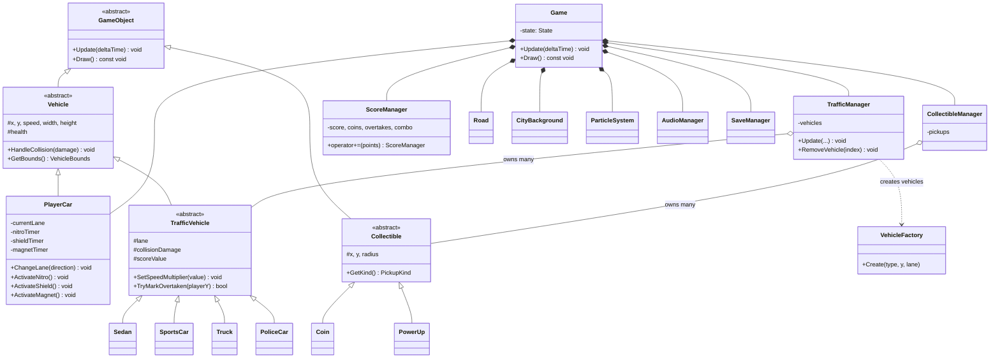

# UML overview

```mermaid
classDiagram
    class GameObject {
        <<abstract>>
        +Update(deltaTime) void
        +Draw() const void
    }
    class Vehicle {
        <<abstract>>
        #x, y, speed, width, height
        #health
        +HandleCollision(damage) void
        +GetBounds() VehicleBounds
    }
    class PlayerCar {
        -currentLane
        -nitroTimer
        -shieldTimer
        -magnetTimer
        +ChangeLane(direction) void
        +ActivateNitro() void
        +ActivateShield() void
        +ActivateMagnet() void
    }
    class TrafficVehicle {
        <<abstract>>
        #lane
        #collisionDamage
        #scoreValue
        +SetSpeedMultiplier(value) void
        +TryMarkOvertaken(playerY) bool
    }
    class Sedan
    class SportsCar
    class Truck
    class PoliceCar
    class Collectible {
        <<abstract>>
        #x, y, radius
        +GetKind() PickupKind
    }
    class Coin
    class PowerUp
    class Game {
        -state: State
        +Update(deltaTime) void
        +Draw() const void
    }
    class TrafficManager {
        -vehicles
        +Update(...) void
        +RemoveVehicle(index) void
    }
    class VehicleFactory {
        +Create(type, y, lane)
    }
    class CollectibleManager {
        -pickups
    }
    class ScoreManager {
        -score, coins, overtakes, combo
        +operator+=(points) ScoreManager
    }
    class Road
    class CityBackground
    class ParticleSystem
    class AudioManager
    class SaveManager

    GameObject <|-- Vehicle
    Vehicle <|-- PlayerCar
    Vehicle <|-- TrafficVehicle
    TrafficVehicle <|-- Sedan
    TrafficVehicle <|-- SportsCar
    TrafficVehicle <|-- Truck
    TrafficVehicle <|-- PoliceCar
    GameObject <|-- Collectible
    Collectible <|-- Coin
    Collectible <|-- PowerUp

    Game *-- PlayerCar
    Game *-- TrafficManager
    Game *-- CollectibleManager
    Game *-- ScoreManager
    Game *-- Road
    Game *-- CityBackground
    Game *-- ParticleSystem
    Game *-- AudioManager
    Game *-- SaveManager
    TrafficManager ..> VehicleFactory : creates vehicles
    TrafficManager o-- TrafficVehicle : owns many
    CollectibleManager o-- Collectible : owns many
```
